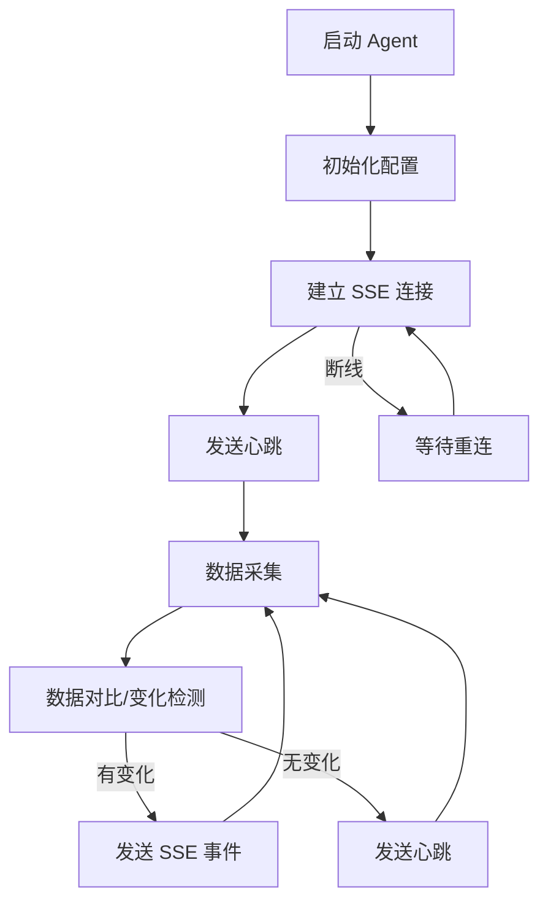
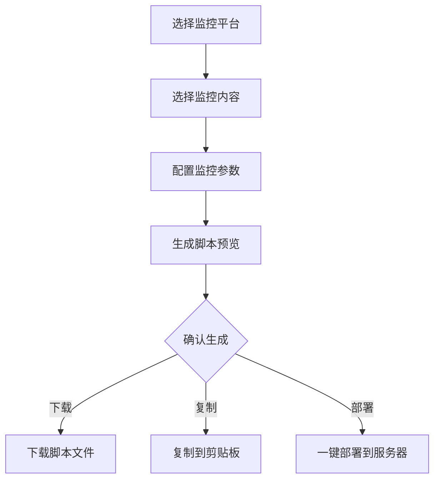

# 服务器监控服务技术设计方案

需求名称：2026-03-28-server-monitoring
更新日期：2026-03-28

## 概述

本项目旨在开发一套实时服务器监控服务，采用前后端分离架构，使用 TypeScript 技术栈。系统由部署在服务器的监控脚本和前端展示平台组成，支持实时状态监控、安全告警等功能。**设计目标：支持 1000+ 服务器同时在线监控**。

## 架构

```mermaid
graph TB
    subgraph 采集层 "Collection Layer"
        Agent1[Agent 1]
        Agent2[Agent 2]
        AgentN[Agent N]
    end
    
    subgraph 传输层 "Transport Layer"
        SSE[SSE 服务集群]
    end
    
    subgraph 展示层 "Presentation Layer"
        Frontend[前端仪表盘]
        AlertSystem[告警系统]
    end
    
    Agent1 -->|"SSE 上报"| SSE
    Agent2 -->|"SSE 上报"| SSE
    AgentN -->|"SSE 上报"| SSE
    SSE -->|"SSE 推送"| Frontend
    SSE -->|"SSE 推送"| AlertSystem
```

### 1000 台服务器架构考虑

| 组件 | 设计 |
|------|------|
| Agent SSE 连接 | Agent 主动建立 SSE 长连接，后端按服务器 ID 路由 |
| 连接管理 | 每个 Agent 维护一个 SSE 连接，断线自动重连 |
| 数据流 | Agent → SSE 通道 → 后端处理 → 前端订阅流 |
| 水平扩展 | SSE 服务多实例，Nginx 负载均衡 |

## 核心功能

### 1. 监控数据采集

- **安全重点关注文件监控**：监控关键系统文件（如 `/etc/passwd`, `/etc/shadow`, `~/.ssh/authorized_keys` 等）的变更
- **外联服务监控**：检测服务器的外网连接、异常外联行为
- **基础资源监控**：CPU、内存、磁盘、网络等基础指标

### 2. 数据传输（SSE 双向推送）

- **Agent → 后端 SSE**：Agent 主动建立 SSE 连接，实时推送监控数据
- **后端 → 前端 SSE**：后端接收 Agent 数据后，通过 SSE 推送给订阅的前端
- **SSE 通道隔离**：每个 Agent 有独立的 SSE 连接，服务器 ID 作为连接标识
- **自动重连**：Agent 和前端均支持断线自动重连

### 3. 前端展示

- 实时仪表盘展示服务器状态
- 告警列表与历史记录
- 告警通知（桌面通知、声音提示）

## 组件与接口

### 后端组件

| 组件 | 职责 |
|------|------|
| SSE Server | 维护 Agent 和前端的双向 SSE 通道 |
| Data Processor | 处理 Agent 上报的数据，触发告警逻辑 |
| Alert Engine | 告警规则引擎，生成告警事件 |
| API Server | 提供 RESTful API |

### 前端组件

| 组件 | 职责 |
|------|------|
| Dashboard | 仪表盘展示所有服务器状态 |
| ServerDetail | 单台服务器详情视图 |
| ScriptGenerator | 自定义监控脚本生成器 |
| AlertManager | 告警管理 |
| Notification | 通知系统 |

### 关键接口

```
Agent SSE 连接:
  GET /sse/agent/:serverId - Agent 建立 SSE 通道，推送监控数据

前端 SSE 订阅:
  GET /sse/frontend/:serverId - 前端订阅指定服务器的实时数据流

REST API:
  GET  /api/servers           - 获取服务器列表
  GET  /api/servers/:id/status - 获取指定服务器状态
  GET  /api/alerts            - 获取告警列表
  POST /api/alerts/:id/ack    - 确认告警
```

## Agent 脚本设计

### 跨平台支持

| 平台 | Shell 环境 |
|------|------------|
| Linux | bash/sh |
| Windows | Git Bash / WSL / MSYS2 |
| 银河麒麟 | bash (兼容标准 Linux) |

### 采集功能

| 功能 | 实现方式 |
|------|----------|
| 安全文件监控 | `inotifywait` (Linux) / 文件 hash 比对 |
| 外联服务监控 | `netstat` / `ss` / ` connections` |
| 基础资源 | `top` / `df` / `free` / `uptime` |

### Agent 脚本架构



### 数据格式

```json
{
  "serverId": "server-001",
  "timestamp": 1711612800000,
  "type": "file_change",
  "data": {
    "files": [
      {
        "path": "/etc/passwd",
        "action": "modified",
        "oldHash": "abc123",
        "newHash": "def456"
      }
    ],
    "connections": [
      {
        "protocol": "tcp",
        "local": "192.168.1.100:22",
        "remote": "10.0.0.1:54321",
        "state": "ESTABLISHED"
      }
    ],
    "resources": {
      "cpu": 45.5,
      "memory": 67.2,
      "disk": 72.1
    }
  }
}
```

### SSE 事件类型

| 事件 | 说明 |
|------|------|
| `heartbeat` | 心跳保活，每 30s 发送 |
| `file_change` | 安全文件变更 |
| `connection_change` | 外联连接变更 |
| `resource_alert` | 资源告警 |
| `status_report` | 完整状态报告（每 60s） |

### ScriptGenerator 功能



#### 监控平台选项

| 平台 | 说明 |
|------|------|
| Linux (Ubuntu/CentOS/Debian) | bash 环境 |
| 银河麒麟 | 国产操作系统，bash |
| Windows | Git Bash / WSL |
| macOS | bash/zsh |

#### 监控内容选项

| 类别 | 监控项 |
|------|--------|
| **安全文件监控** | 系统文件变更 (`/etc/passwd`, `/etc/shadow`, `~/.ssh/*`) |
| **外联服务监控** | TCP/UDP 连接、异常外联 IP |
| **基础资源监控** | CPU、内存、磁盘使用率 |
| **自定义监控** | 用户自定义脚本/命令 |

#### 脚本生成流程

```
前端配置 → JSON 参数 → 模板引擎 → Shell 脚本
```

#### 生成脚本示例

```bash
#!/bin/bash
# ===========================================
# 自动生成的监控脚本
# 服务器ID: {{SERVER_ID}}
# 监控平台: {{PLATFORM}}
# 生成时间: {{GENERATED_TIME}}
# ===========================================

# 配置区
SERVER_URL="{{SERVER_URL}}"
SERVER_ID="{{SERVER_ID}}"
HEARTBEAT_INTERVAL={{HEARTBEAT_INTERVAL}}

# 监控项配置
MONITOR_FILES={{MONITOR_FILES}}
MONITOR_CONNECTIONS={{MONITOR_CONNECTIONS}}
MONITOR_RESOURCES={{MONITOR_RESOURCES}}

# ... 后续脚本逻辑
```

#### 界面设计

| 区域 | 内容 |
|------|------|
| 平台选择 | 单选框：Linux / 银河麒麟 / Windows / macOS |
| 监控内容 | 多选框：文件监控、连接监控、资源监控 |
| 高级配置 | 可折叠：心跳间隔、自定义监控项 |
| 脚本预览 | 实时预览生成的脚本内容 |
| 操作按钮 | 下载 / 复制 / 一键部署 |

### 脚本文件结构

```
agent/
├── monitor.sh          # 主入口脚本
├── config.sh          # 配置文件
├── lib/
│   ├── logger.sh      # 日志模块
│   ├── sse.sh         # SSE 连接模块
│   ├── collector/
│   │   ├── file_monitor.sh    # 文件监控
│   │   ├── connection_monitor.sh  # 外联监控
│   │   └── resource_monitor.sh   # 资源监控
│   └── utils.sh       # 工具函数
└── README.md          # 部署说明
```

### 部署方式

```bash
# Linux/macOS
curl -sSL https://example.com/install.sh | bash

# 银河麒麟
curl -sSL https://example.com/install.sh | bash

# Windows (Git Bash)
curl -sSL https://example.com/install.sh | bash
```

### 配置项

```bash
# config.sh
SERVER_URL="http://monitor-server:3000"
SERVER_ID="server-001"  # 由后端注册时分配
HEARTBEAT_INTERVAL=30
RETRY_INTERVAL=5
LOG_FILE="/var/log/monitor-agent.log"
```

## 技术选型

| 层级 | 技术 |
|------|------|
| 前端框架 | React 18 + TypeScript + Vite |
| 后端 | Node.js + TypeScript + Fastify |
| SSE | 原生 EventSource / 库 |
| Agent | Shell + Python / Node.js |
| 负载均衡 | Nginx / 内部轮询 |
| 数据存储 | SQLite / PostgreSQL |
| 消息队列 | Redis Pub/Sub（用于多 SSE 实例间协调） |

## 性能设计（1000 台服务器）

1. **Agent 高效上报**：批量上报减少 HTTP 请求频率
2. **SSE 连接池**：每个前端连接维护独立的 SSE 通道，按需订阅
3. **Redis Pub/Sub**：多个 SSE 服务实例间同步数据
4. **心跳机制**：Agent 定期心跳，自动移除离线服务器
5. **分页加载**：服务器列表分页查询，避免一次性加载

## 下一步

请确认以上设计方向是否符合您的预期：
1. SSE 推送 + 1000 台服务器支持的架构设计是否合理？
2. 技术选型是否合适？
3. 是否有其他特殊需求？
